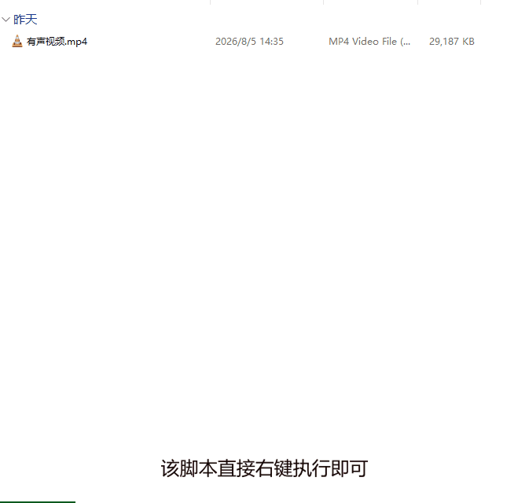

# 🔇 视频音轨移除

一键从视频文件中移除音轨，基于 FFmpeg 流复制（无损），保留画质与字幕，支持批量处理。

---

## 📖 简介

本工具提供右键菜单集成，在文件资源管理器中选中视频文件，右键即可一键移除音轨。采用流复制（`-c copy`）无损处理，不重新编码，画质零损失，字幕自动保留。

### ✨ 核心特性

- **无损处理**：流复制（`-c copy`），不重新编码，画质与字幕完整保留
- **右键菜单集成**：选中视频 → 右键 → 一键移除
- **批量处理**：支持同时选中多个视频文件批量移除
- **智能跳过**：无音轨的视频自动跳过，输出文件已存在时自动跳过（绝不覆盖原文件）
- **实时进度**：处理过程中实时显示百分比

---
## 脚本演示


---
## 📦 安装方法

* 通过不忙脚本盒子安装（推荐）
  
  * 下载并安装 [不忙脚本盒子](https://www.bm-box.cn/)
  
  * 打开不忙脚本盒子 → **脚本市场** → 搜索 **「视频压缩」**
  
  * 点击「安装」

* 手动安装(有编程基础)

```bash
# 1. 安装 FFmpeg（ffmpeg 命令需在 PATH 中可用）
# https://ffmpeg.org/download.html
# 2. 配置python环境
uv venv
uv sync
# 3. 启动脚本
python main.py <参数JSON路径>  # 参数JSON由盒子右键调用时自动生成
```

---

## 🚀 启动方式

通过不忙脚本盒子安装后，可通过以下方式使用「视频音轨移除」功能：

* 配置参数（首次使用或需修改配置时）
  
  * 打开「不忙脚本盒子」
  
  * 点击「视频音轨移除」进入配置窗口
  
  * 根据需求设置转换参数
  
  * 点击「保存配置」

* 执行音频格式转换（日常使用）
  
  * 在文件管理器中选中视频文件
  
  * 右键点击，选择「视频音轨移除」
  
  * 脚本自动按保存的配置执行音轨移除

* 快捷键操作
  
  * 为脚本设置全局快捷键
  
  * 选中视频后按下快捷键即可快速执行

✅ 配置保存后永久生效，无需每次重复设置

🔄 仅在需要更改参数时才需重新进入配置窗口

---

## 🖥️ 环境要求

| 项目       | 要求                 |
| -------- | ------------------ |
| **操作系统** | Windows 10+（64位）   |
| **运行环境** | python3.8,  FFmpeg |

---

## 💡 使用提示

- **输出位置**：输出文件保存在原视频旁，命名为「<视频名>_无音轨.<原扩展名>」，绝不覆盖原文件
- **无音轨视频**：视频本身不含音轨时会自动跳过，并提示原因
- **字幕保留**：移除音轨的同时会保留字幕流（如有），画质不损失
